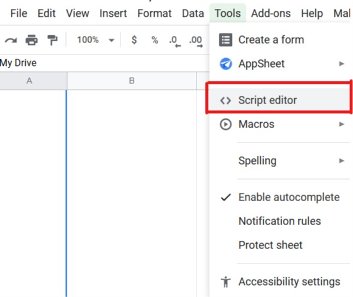
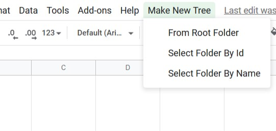
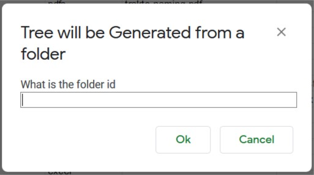
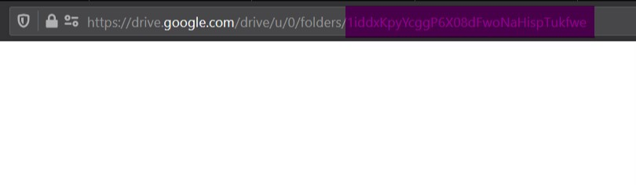
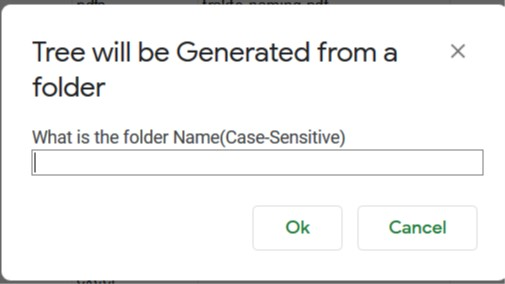
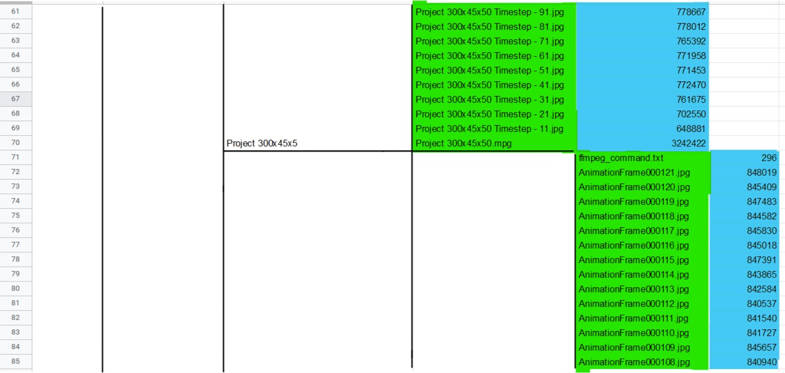

# List Files in Google Drive

## This App Script will List all files in the Drive in a Tree Structure in Google Sheets
 

---
---
## **Setting Up**
---
---
 

Open a new Google Sheets and goto 

* Tools > Script Editor

* This will open a new App Script file with a <b>Code.gs </b>already present.

* Paste the Script from `listFilesInDrive.gs` to the newly created app script.

* Save and Close

* Refresh the Google Sheets

* A New Menu Item named **Make New Tree** will be present

 
 

 
 

---
---

## **Using the App**

---
---

* ## From Root Folder(Recommended)
  It Will Create a New Sheet with the Name 
  > \<Your User Name> \<Date and Time>

  And with your `https://drive.google.com/drive/my-drive` as the Base it will start creating all the tree structure of all the files present in your drives. If a folder is empty it will be ingnored.

 

* ## Select Folder By Id(Recommended)
  If you Need the Tree Structure from only any specific folder then use this option

  On Clicking this you will be prompted to enter the Foder Id.

    

  The Part After `https://drive.google.com/drive/my-drivefolders/` is the Id of any folder

    

  Paste it to the dialogue Box and Click **Ok.**
  It Will Create a New Sheet with the Name 
  > \<Your User Name> \<Date and Time>

  And then generate the tree structutre.

 
 

* ## Select Folder By Name
  If you Need the Tree Structure from only any specific folder then use this option

  On Clicking this you will be prompted to enter the Foder Name.

    

Name will be the **FolderName** which is given to the Folder in google drive.

  Paste it to the dialogue Box and Click **Ok.**
  It Will Create a New Sheet with the Name 
  > \<Your User Name> \<Date and Time>

  And then generate the tree structutre.

If more than 2 forders having the same name is present in the drive then using [Select Folder By Id](#folderById) would be the better Option.

 
 

---
---
## **RESULT**
---
---

This will be how it will look in Google Sheets. The **unhighlighted** portion will be the folders with Name of folder as name of the merged cell. The cells marked in **green** shows the file name and the ones marked in **blue** will show the size of the particular file in bytes.